# Landing QA

Generated 2026-09-16T10:41:26.350Z against http://localhost:3000. One screenshot per section at 1280px and 390px, with the feeling each section is meant to leave.

- desktop: document scroll width 1280px at viewport 1280px
- phone: document scroll width 632px at viewport 390px (HORIZONTAL OVERFLOW)

## hero

The loss in one line, then the product revealed pixel by pixel.

## brands

Serious institutions already named the problem this year.

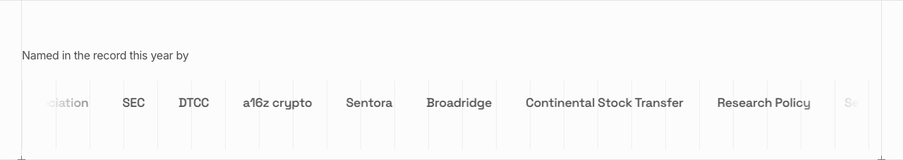

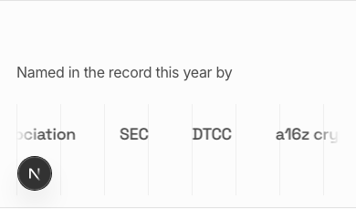

## check

The reader tests a wallet before reading anything else.

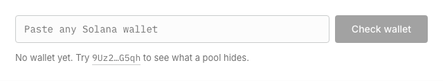

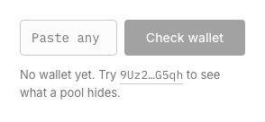

## works

Four steps as tab cards; the image on the right follows the active card.

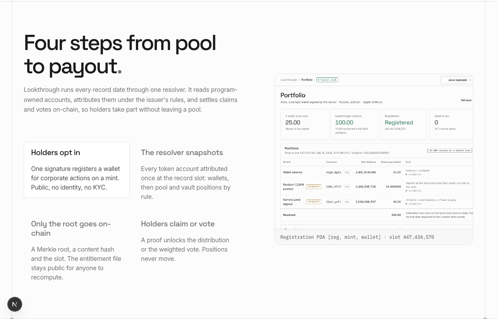

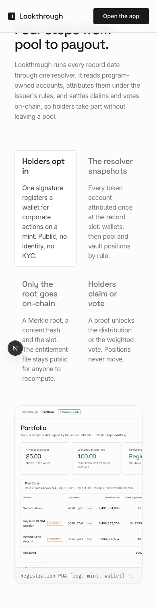

## choice

The four-column table, then the 2x2 with the empty corner shaded.

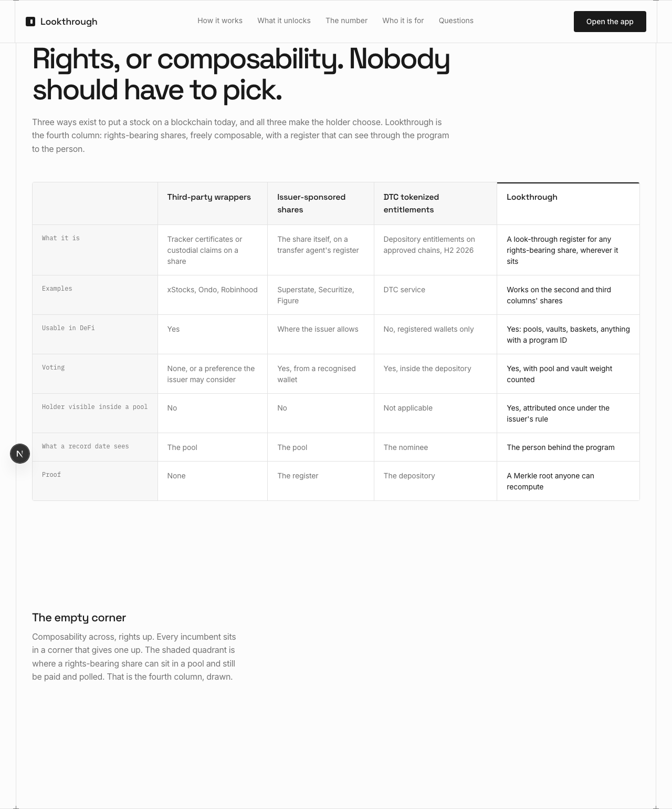

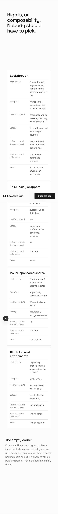

## feature

Two live actions, three next, all on the same root.

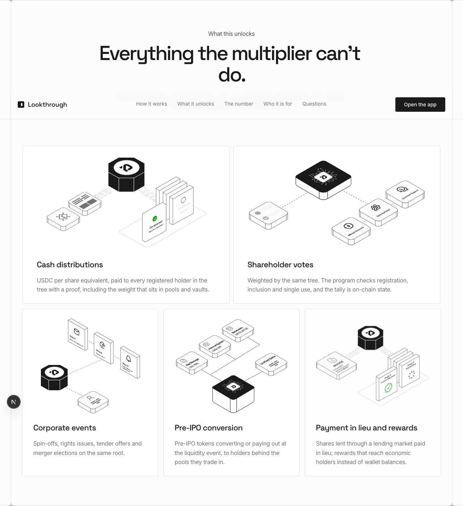

## number

Four measured figures counting up, with their slots.

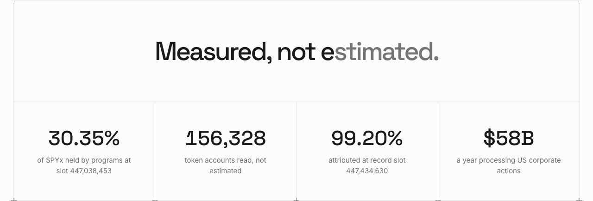

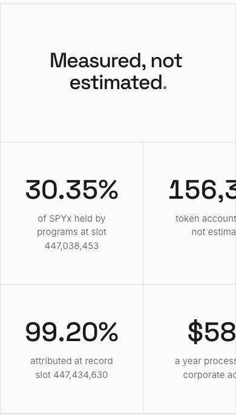

## evidence

The sources cycle through the accordion; every one names the problem, none ships the look-through.

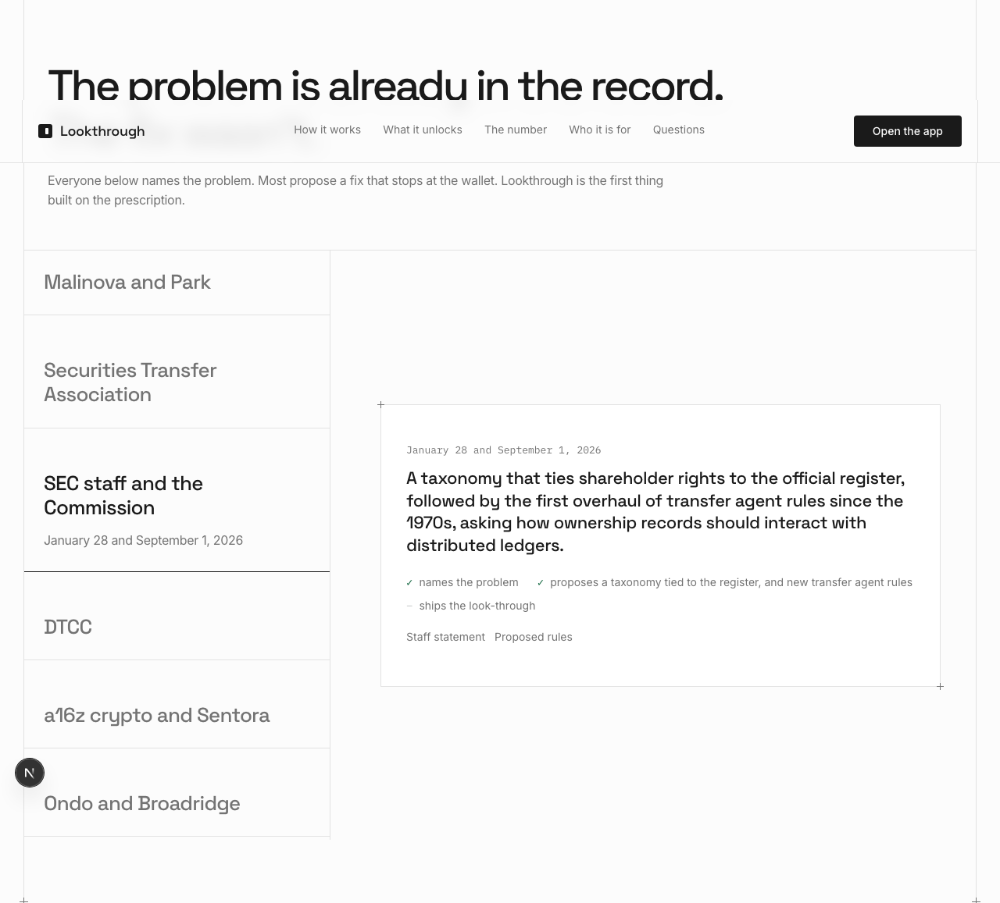

## problem

Three bank statements: yours, the pool's, and the one Lookthrough writes.

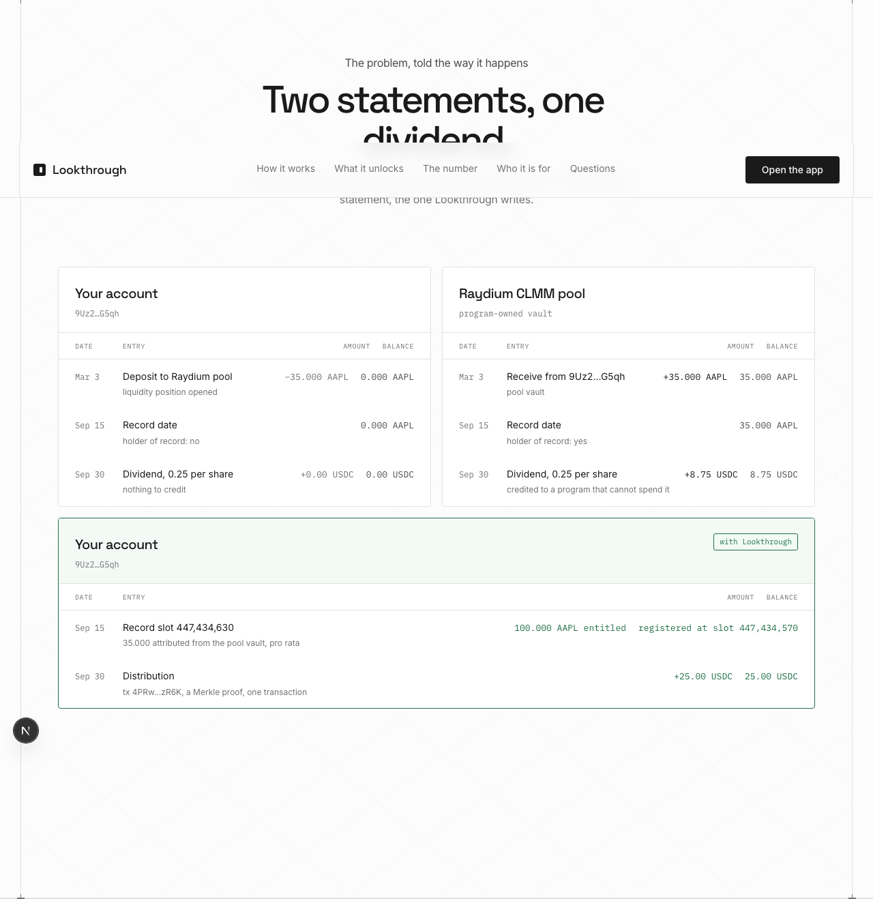

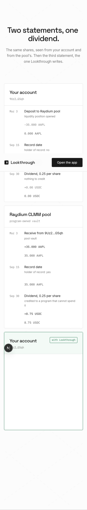

## pricing

Three audiences laid out like the plan table, each with a real figure.

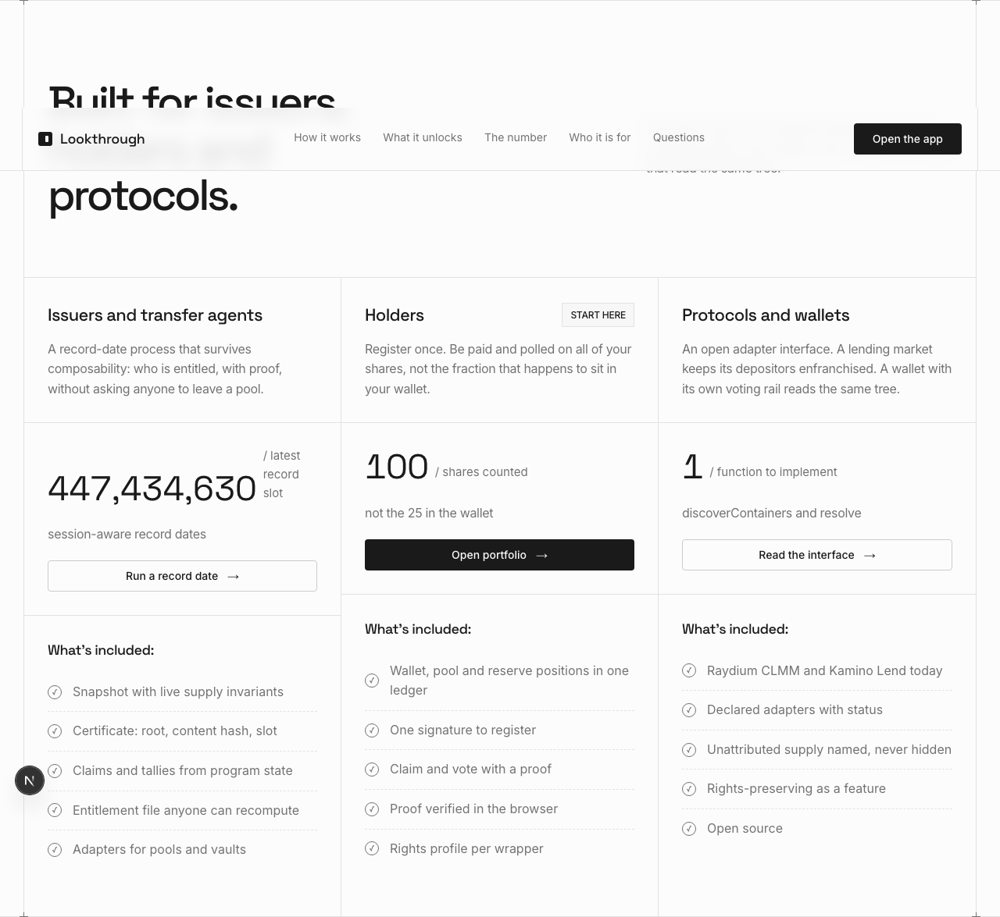

## questions

Boxed accordion, one answer open at a time.

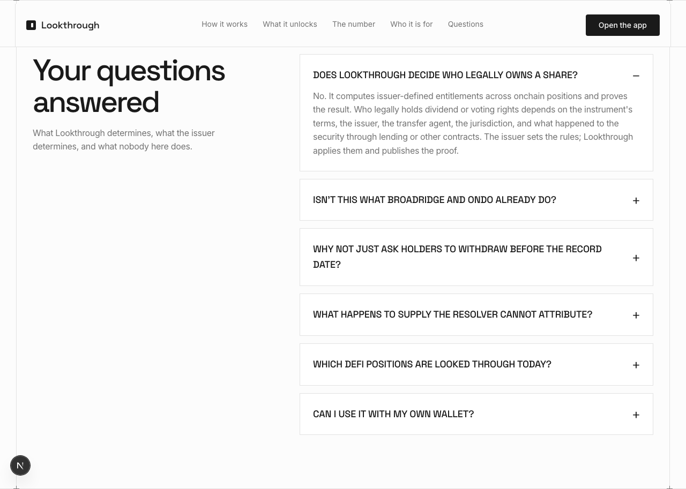

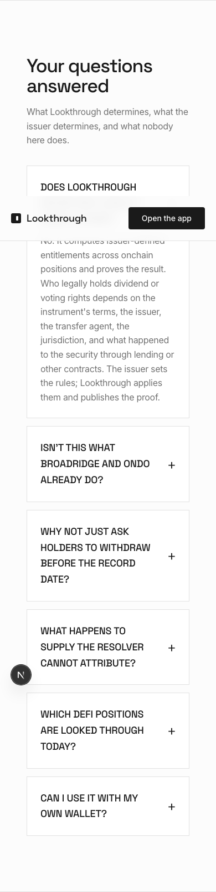

## cta

The closing line and the two doors.

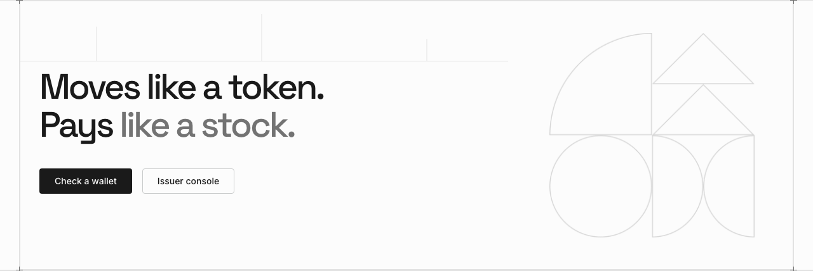

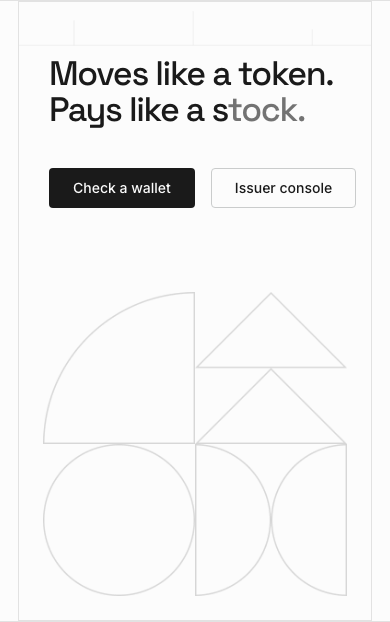

## Console errors

None.
